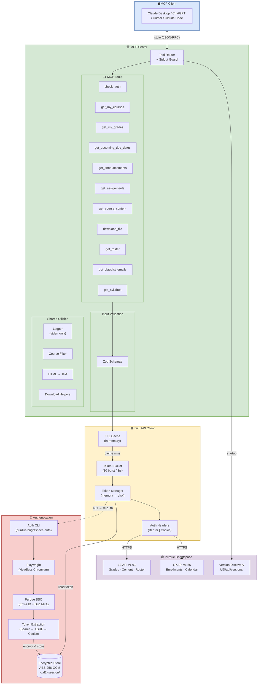
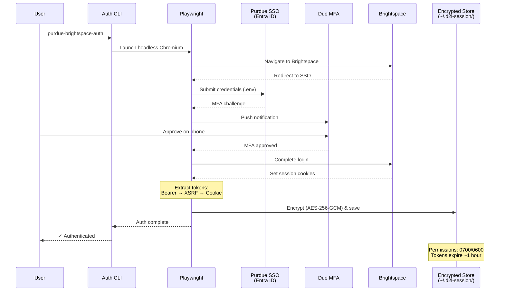
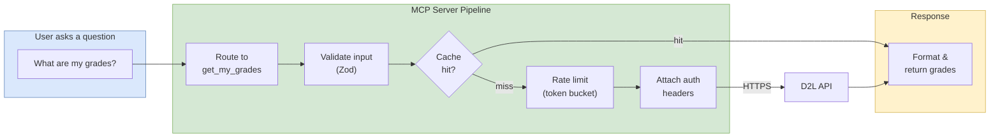

# Purdue Brightspace MCP Server

> **Created by [Rohan Muppa](https://github.com/rohanmuppa)**

Access your Purdue Brightspace courses using natural language. Get grades, due dates, announcements, rosters, and more. Works with any MCP client (Claude Desktop, ChatGPT Desktop, Claude Code, Cursor, etc.).

## Architecture

### System Overview



### Authentication Flow



### Request Lifecycle



## What You Can Do

- "What assignments are due this week?"
- "Show my grades for CS 252"
- "What announcements did my professors post today?"
- "Who is the instructor for MATH 266?"
- "Download the lecture slides from Module 3"
- "What's my grade in all my classes?"
- "Get me the roster emails for my CS course"

## Prerequisites

1. **Node.js** (version 18 or higher)
   - Download from https://nodejs.org/ (choose the LTS version)
   - To check if you already have it: Open Terminal (Mac) or Command Prompt (Windows) and type `node --version`

2. **An MCP client** (any of these work)
   - [Claude Desktop](https://claude.ai/download)
   - [Claude Code](https://docs.anthropic.com/en/docs/claude-code)
   - [ChatGPT Desktop](https://openai.com/chatgpt/desktop/)
   - [Cursor](https://cursor.com)
   - Or any other app that supports MCP

## Setup

### Step 1: Clone this repository

Open Terminal (Mac) or Command Prompt (Windows) and run:

```bash
git clone https://github.com/RohanMuppa/purdue-brightspace-mcp.git
cd purdue-brightspace-mcp
```

### Step 2: Install dependencies

```bash
npm install
```

This will take about 1-2 minutes. It will also automatically install Chromium (used for authentication).

### Step 3: Set up your credentials

Copy the example environment file and fill in your Purdue credentials:

**Mac/Linux:**
```bash
cp .env.example .env
```

**Windows (Command Prompt):**
```cmd
copy .env.example .env
```

Then open `.env` in a text editor and replace the placeholders:

```
D2L_USERNAME=your_purdue_username
D2L_PASSWORD=your_purdue_password
```

Use your Purdue career account username (not your email). Your credentials stay on your machine and are never sent anywhere except Purdue's login page.

### Step 4: Build the project

```bash
npm run build
```

This compiles the TypeScript code. It should complete in a few seconds.

### Step 4: Link the CLI tools

```bash
npm link
```

This registers the `purdue-brightspace-auth` command globally so you can run it from anywhere.

### Step 5: Authenticate with Brightspace

```bash
purdue-brightspace-auth
```

Or if you prefer, you can also run it with npm:

```bash
npm run auth
```

**What happens:**
1. A browser window will open and log in automatically using your `.env` credentials
2. Approve the Duo push notification on your phone
3. The browser will close automatically once authenticated

**Note:** You only need to do this once. The session lasts about 1 hour. When it expires, just run `npm run auth` again.

### Step 6: Configure your MCP client

Choose the setup instructions for your MCP client:

#### Claude Desktop

**Config file location:**
- **Mac**: `~/Library/Application Support/Claude/claude_desktop_config.json`
- **Windows**: `%APPDATA%\Claude\claude_desktop_config.json`

Open the config file in a text editor and add this configuration (if the file doesn't exist, create it):

```json
{
  "mcpServers": {
    "purdue-brightspace": {
      "command": "node",
      "args": ["/absolute/path/to/purdue-brightspace-mcp/build/index.js"]
    }
  }
}
```

**Important:** Replace `/absolute/path/to/purdue-brightspace-mcp` with the actual path on your computer.

To find the path:
- **Mac/Linux**: In Terminal, go to the project directory and run `pwd`
- **Windows**: In Command Prompt, go to the project directory and run `cd`

**Example (Mac):**
```json
{
  "mcpServers": {
    "purdue-brightspace": {
      "command": "node",
      "args": ["/Users/username/purdue-brightspace-mcp/build/index.js"]
    }
  }
}
```

**Example (Windows):**
```json
{
  "mcpServers": {
    "purdue-brightspace": {
      "command": "node",
      "args": ["C:\\Users\\username\\purdue-brightspace-mcp\\build\\index.js"]
    }
  }
}
```

See `claude-desktop-config.example.json` for the full example.

#### Cursor

**Config file location (choose one):**
- **Project-level**: `.cursor/mcp.json` in the project root
- **Global** (recommended for this server): `~/.cursor/mcp.json`

Create or open the config file and add this configuration:

```json
{
  "mcpServers": {
    "purdue-brightspace": {
      "command": "node",
      "args": ["/absolute/path/to/purdue-brightspace-mcp/build/index.js"]
    }
  }
}
```

**Important:** Replace `/absolute/path/to/purdue-brightspace-mcp` with the actual path on your computer (use `pwd` on Mac/Linux or `cd` on Windows to find it).

**Example (Mac):**
```json
{
  "mcpServers": {
    "purdue-brightspace": {
      "command": "node",
      "args": ["/Users/username/purdue-brightspace-mcp/build/index.js"]
    }
  }
}
```

**Example (Windows):**
```json
{
  "mcpServers": {
    "purdue-brightspace": {
      "command": "node",
      "args": ["C:\\Users\\username\\purdue-brightspace-mcp\\build\\index.js"]
    }
  }
}
```

Save the file and **restart Cursor** to load the MCP server.

See `cursor-config.example.json` for the full example.

#### ChatGPT Desktop

ChatGPT Desktop configures MCP servers through its Settings UI, not a JSON file.

**Setup steps:**
1. Open ChatGPT Desktop
2. Go to **Settings**
3. Scroll down to find **"MCP Servers"** (may be under a Features or Tools section)
4. Click **"Add Server"** (or similar button)
5. Enter the following:
   - **Server name**: `purdue-brightspace`
   - **Command**: `node`
   - **Argument**: `/absolute/path/to/purdue-brightspace-mcp/build/index.js` (replace with your actual path)

To find your path:
- **Mac/Linux**: In Terminal, go to the project directory and run `pwd`
- **Windows**: In Command Prompt, go to the project directory and run `cd`

**Example paths:**
- Mac: `/Users/username/purdue-brightspace-mcp/build/index.js`
- Windows: `C:\Users\username\purdue-brightspace-mcp\build\index.js`

**Note:** ChatGPT Desktop's MCP support may be in beta or rolling out gradually. If you don't see the MCP Servers option yet, check for app updates.

See `chatgpt-desktop-config.example.json` for a reference config structure.

---

After configuring your MCP client, **restart it completely** (quit and reopen, not just close the window).

### Step 7: Verify it works

1. Open your MCP client
2. Start a new conversation
3. Try asking: **"What are my courses?"**

If it works, you'll see a list of your Brightspace courses!

## Available Tools

| Tool | Description |
|------|-------------|
| `check_auth` | Check if you're logged in to Brightspace |
| `get_my_courses` | Get all your enrolled courses |
| `get_upcoming_due_dates` | Get assignments and quizzes due soon |
| `get_my_grades` | Get your grades for one or all courses |
| `get_announcements` | Get course announcements |
| `get_assignments` | Get detailed assignment and quiz information |
| `get_course_content` | Browse course content (modules, files, links) |
| `download_file` | Download course files or submission attachments |
| `get_classlist_emails` | Get email addresses for instructors and TAs |
| `get_roster` | Get course roster (instructors, TAs, optionally students) |

## Advanced Configuration

### Filter courses

If you have a lot of courses and want to hide some, you can add course filters to your MCP client config:

```json
{
  "mcpServers": {
    "purdue-brightspace": {
      "command": "node",
      "args": ["/absolute/path/to/purdue-brightspace-mcp/build/index.js"],
      "env": {
        "D2L_INCLUDE_COURSES": "123456,789012",
        "D2L_EXCLUDE_COURSES": "111111,222222",
        "D2L_ACTIVE_ONLY": "true"
      }
    }
  }
}
```

**Options:**
- `D2L_INCLUDE_COURSES`: Only show these course IDs (comma-separated). Overrides other filters.
- `D2L_EXCLUDE_COURSES`: Hide these course IDs (comma-separated).
- `D2L_ACTIVE_ONLY`: Set to `"false"` to show inactive courses (default: `"true"`).

**How to find course IDs:**
Ask "What are my courses?" and the tool will show the IDs.

### Re-authenticate

Your Brightspace session expires after about 1 hour. When it does, the server will report "Not authenticated."

To log in again:
```bash
purdue-brightspace-auth
```

You don't need to restart your MCP client after re-authenticating.

## Updating

To update to the latest version:

```bash
purdue-brightspace-update
```

This pulls the latest code, installs any new dependencies, and rebuilds automatically. Restart your MCP client after updating.

## Troubleshooting

**"Not authenticated" error**
- **Solution**: Run `purdue-brightspace-auth` (or `npm run auth` in the project directory). The browser will open and you'll log in again.

**MCP client doesn't respond to Brightspace queries**
- **Solution 1**: Restart your MCP client completely (quit and reopen, not just close the window).
- **Solution 2**: Check that the path in your MCP config is correct and points to `build/index.js`.
- **Solution 3**: Make sure you ran `npm run build` after any code changes.

**Browser doesn't open during authentication**
- **Solution**: Make sure you have a default browser set. Try running `npm run auth` again. If it still doesn't work, check that Chromium was installed correctly with `npx playwright install chromium`.

**Authentication fails on Windows**
- **Solution 1**: Make sure your `.env` file is in the project root directory (same folder as `package.json`) with your credentials filled in. The auth CLI reads credentials from this file.
- **Solution 2**: Run `npm run auth` from the project directory (not `purdue-brightspace-auth` globally) to ensure the `.env` file is found.
- **Solution 3**: If Chromium fails to install, run `npx playwright install chromium` manually.

## Security

- Your Purdue credentials are never stored in this repository or in the code.
- Session tokens are encrypted using AES-256-GCM and stored in `~/.d2l-session/` (outside this project).
- Token files have restricted permissions (only your user account can read them).
- Tokens expire after about 1 hour for security.
- All communication with Brightspace uses HTTPS.

## Contributing

Found a bug or have a feature request? Open an issue on GitHub!

## License

AGPL-3.0-only — Copyright (c) 2026 Rohan Muppa

## Author

**Rohan Muppa**
GitHub: [@rohanmuppa](https://github.com/rohanmuppa)
Project: [purdue-brightspace-mcp](https://github.com/rohanmuppa/purdue-brightspace-mcp)
